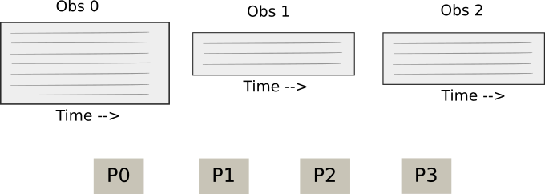
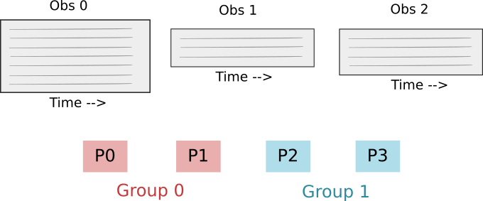
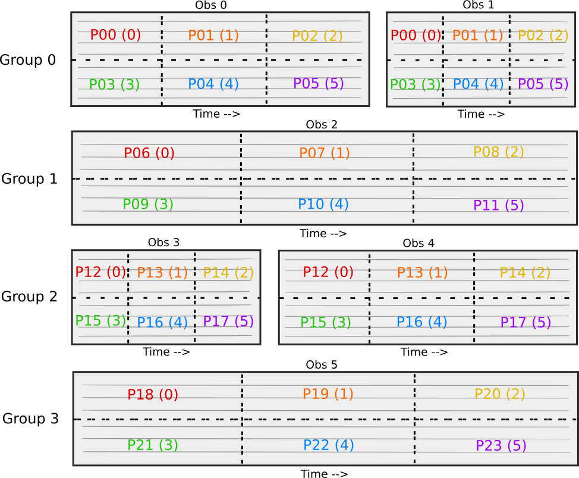

.. _data:

Data
=================

TOAST works with data organized into *observations*.  Each observation is independent of
any other observation.  An observation consists of co-sampled detectors for some span of
time.  The intrinsic detector noise is assumed to be stationary within an observation.
Typically there are other quantities which are constant for an observation (e.g.
elevation, weather conditions, satellite procession axis, etc).

A TOAST workflow consists of one or more (distributed) observations representing the data, and a series of *operators* that "do stuff" with this data.  The following sections detail the classes that represent TOAST data sets and how that data is distributed among many MPI processes.

Related Classes
------------------

An observation is just a dictionary with at least one member ("tod") which is an
instance of a class that derives from the `toast.TOD` base class.  Every experiment will
have their own TOD derived classes, but TOAST includes some built-in ones as well.

TOD Base Class
~~~~~~~~~~~~~~~~~~~

The base class is not used directly, but provides the interfaces required by all derived classes.  The inputs to the TOD base class constructor are at least:

1. The detector names for the observation.
2. The number of samples in the observation.
3. The geometric offset of the detectors from the boresight.
4. Information about how detectors and samples should distributed among processes.

.. autoclass:: toast.tod.TOD
    :members:

The TOD class can act as a storage container for different "flavors" of timestreams as
well as a source and sink for the observation data (with the `read_*()` and `write_*()`
methods).  The TOD base class has one member which is a `Cache` class.  This `cache`
member is where alternate flavors of the timestream data are stored.

Cache Class
~~~~~~~~~~~~~~~~~~~~~

A `Cache` class behaves like a dictionary of N-dimensional numpy arrays.  A restricted set of basic dtypes are supported.  The memory for each buffer is allocated outside
of Python in flat-packed and aligned storage.  This means that it can be explicitly managed / freed, and can also be used directly in routines that require aligned memory for SIMD operations.

.. autoclass:: toast.cache.Cache
    :members:

Noise Model
~~~~~~~~~~~~~~~~

Each observation can also have a noise model associated with it.  An instance of a Noise
class (or derived class) describes the noise properties for all detectors in the
observation.

.. autoclass:: toast.tod.Noise
    :members:

Intervals
~~~~~~~~~~~~~~~~~

Within each TOD object, a process contains some local set of detectors and range of
samples.  That range of samples may contain one or more contiguous "chunks" that were
used when distributing the data.  Separate from this data distribution, TOAST has the
concept of valid data "intervals".  This list of intervals applies to the whole
observation, and all processes have a copy of this list.  This list of intervals is
useful to define larger sections of data than what can be specified with per-sample
flags.  A single interval looks like this:

.. autoclass:: toast.tod.Interval
    :members:

The Data Class
~~~~~~~~~~~~~~~~~~~~~~~~~~~

The data used by a TOAST workflow consists of a list of observations, and is
encapsulated by the `toast.Data` class.

.. autoclass:: toast.dist.Data
    :members:

If you are running with a single process, that process has all observations and all data
within each observation locally available.  If you are running with more than one
process, the data with be distributed across processes.

Distribution
--------------------------

Although you can use TOAST without MPI, the package is designed for data that is
distributed across many processes.  When passing the data through a toast workflow, the
data is divided up among processes based on the details of the `toast.Comm` class that
is used and also the shape of the process grid in each observation.

A toast.Comm instance takes the global number of processes available (MPI.COMM_WORLD)
and divides them into groups. Each process group is assigned one or more observations.
Since observations are independent, this means that different groups can be
independently working on separate observations in parallel. It also means that
inter-process communication needed when working on a single observation can occur with a
smaller set of processes.

.. autoclass:: toast.mpi.Comm
    :members:

Just to reiterate, if your `toast.Comm` has multiple process groups, then each group
will have an independent list of observations in `toast.Data.obs`.

What about the data *within* an observation?  A single observation is owned by exactly
one of the process groups.  The MPI communicator passed to the TOD constructor is the
group communicator.  Every process in the group will store some piece of the observation
data.  The division of data within an observation is controlled by the `detranks` option
to the TOD constructor.  This option defines the dimension of the rectangular "process
grid" along the detector (as opposed to time) direction.  Common values of `detranks`
are:

    * "1" (processes in the group have all detectors for some slice of time)
    * Size of the group communicator (processes in the group have some of the detectors for the whole time range of the observation)

The detranks parameter must divide evenly into the number of processes in the group communicator.

Examples
~~~~~~~~~~~~~~~

It is useful to walk through the process of how data is distributed for a simple case.  We have some number of observations in our data, and we also have some number of MPI processes in our world communicator:

Starting point:  Observations and MPI Processes.

Defining the process groups:  We divide the total processes into equal-sized groups.

.. figure:: _static/data_dist_3.png

Assign observations to groups:  Each observation is assigned to exactly one group.  Each group has one or more observations.

.. figure:: _static/data_dist_4.png

The `detranks` TOD constructor argument specifies how data **within** an observation is distributed among the processes in the group.  The value sets the dimension of the process grid in the detector direction.  In the above case, `detranks = 1`, so the process group is arranged in a one-dimensional grid in the time direction.

.. figure:: _static/data_dist_5.png

In the above case, the `detranks` parameter is set to the size of the group.  This means that the process group is arranged in a one-dimensional grid in the process direction.

Now imagine a more complicated case (not currently used often if at all) where the
process group is arranged in a two-dimensional grid.  This is useful as a visualization
exercise.  Let's say that MPI.COMM_WORLD has 24 processes. We split this into 4 groups
of 6 procesess. There are 6 observations of varying lengths and every group has one or 2
observations.  For this case, we are going to use `detranks = 2`.  Here is a picture of
what data each process would have. The global process number is shown as well as the
rank within the group:

.. include:: data_builtin.inc
